# aarty: A simple CLI tool to convert images to ASCII art with Rust 🦀

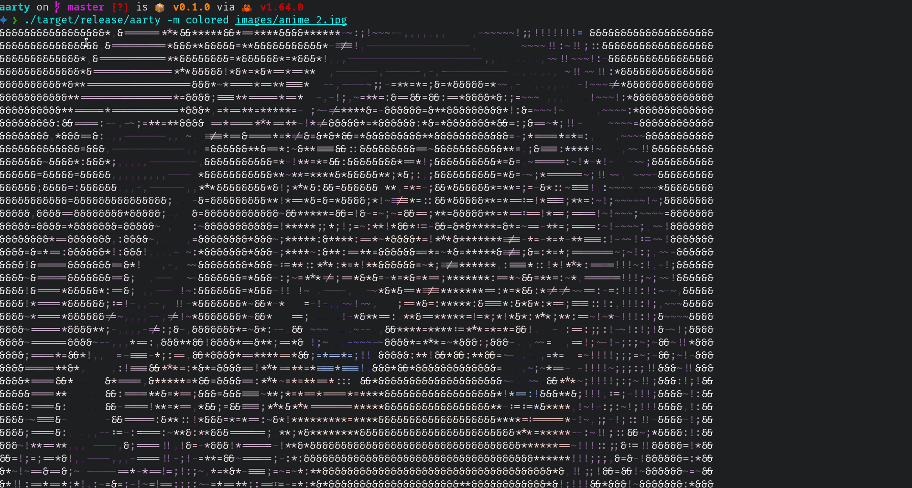
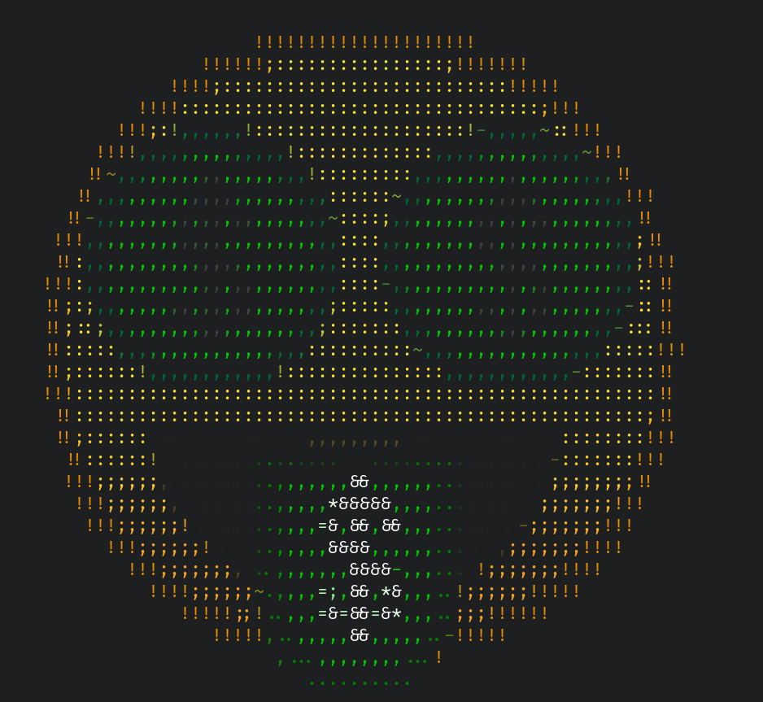
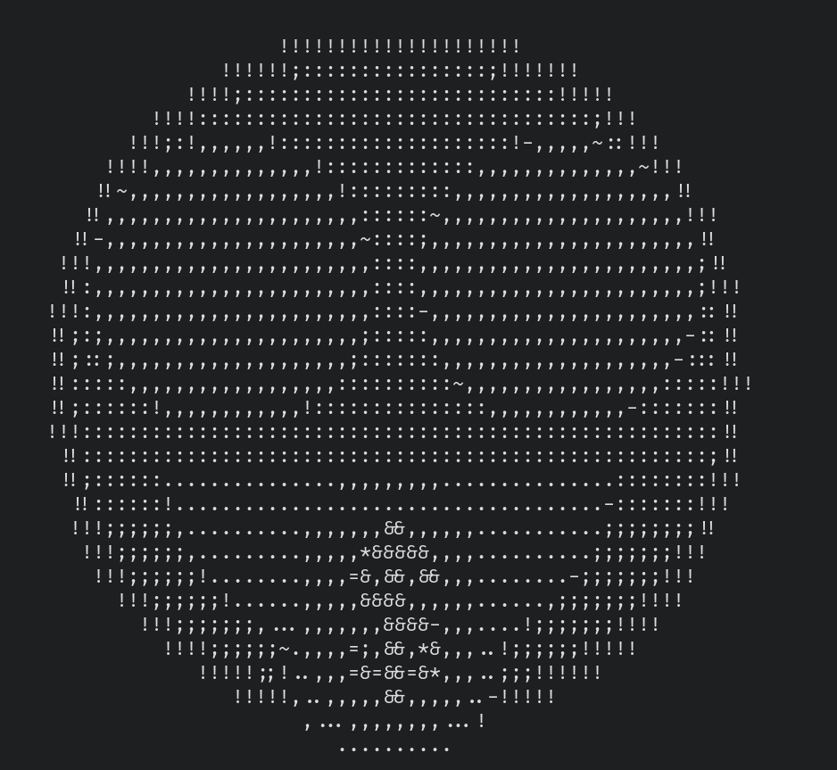

<details>
<summary>More screenshots</summary>


[Original image](./images/crab.png)
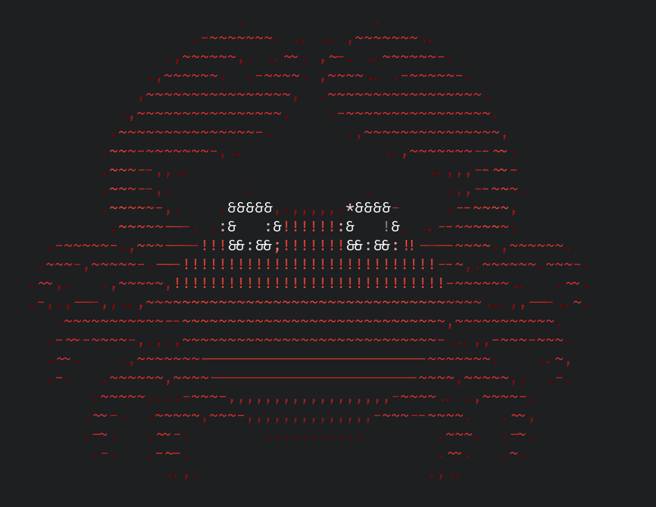
[Original image](./images/crab.png)
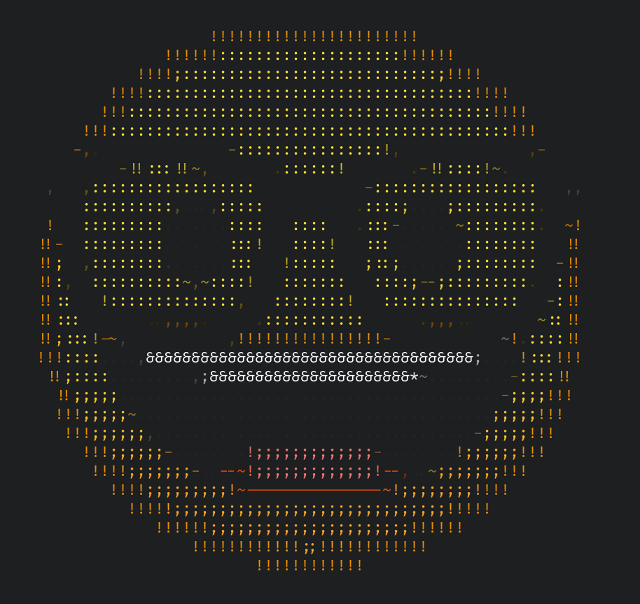
[Original image](./images/nerd_face.png)
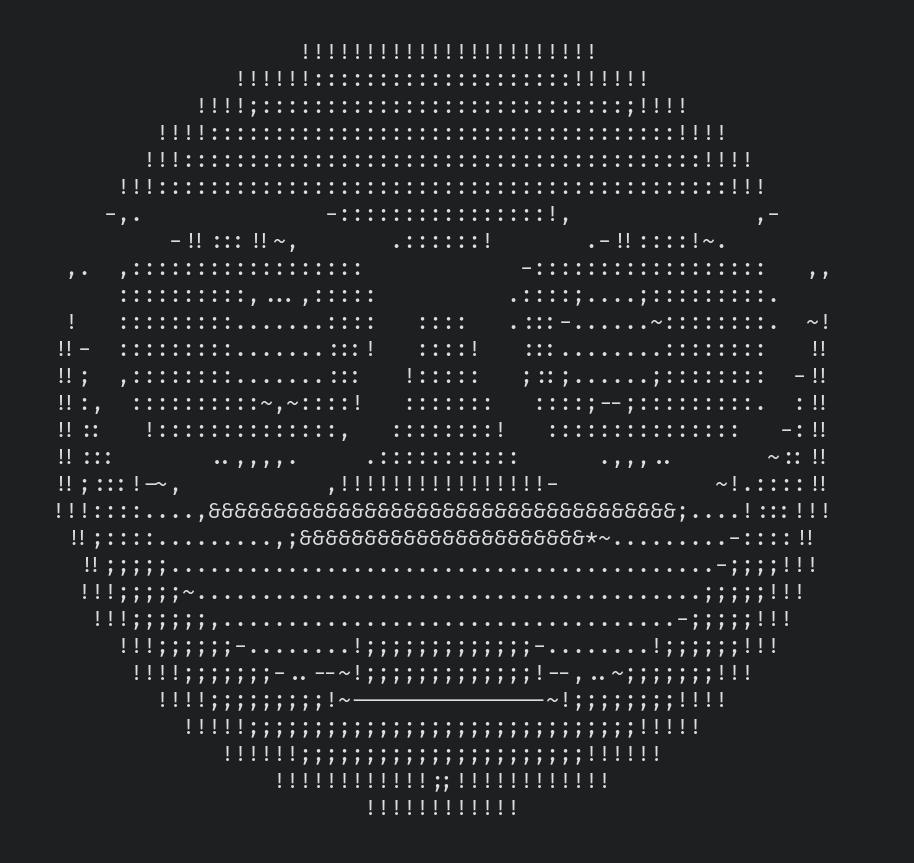
[Original image](./images/nerd_face.png)

[Original image](./images/anime_2.jpg)
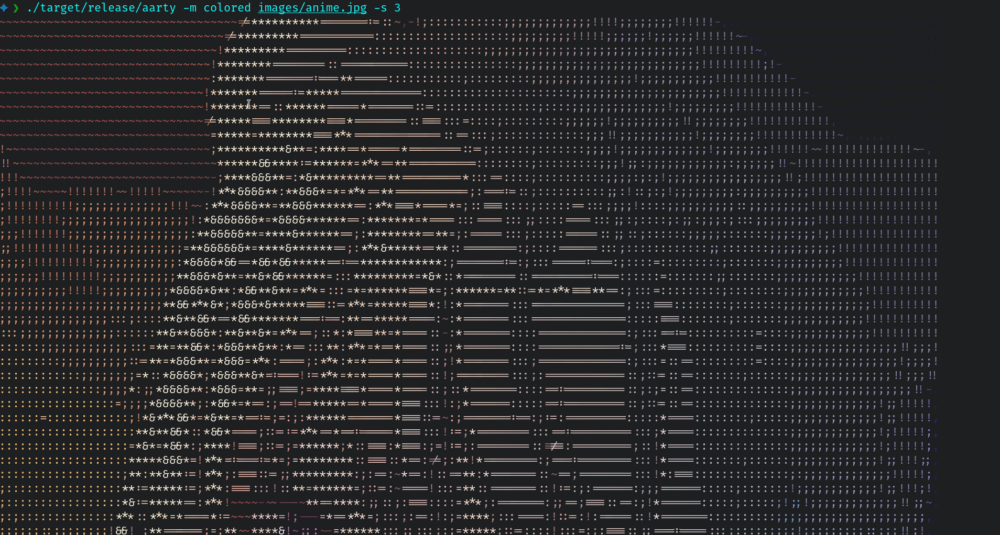
[Original image](./images/anime.jpg)

</details>

```
           ~~~~~~~!!!!~!!~                ~!!!!!!!!!~~~~~           
         ~~~~!!!!!!!!!!!!!!!!           !!!!!!!!!!!!!!!!~~~~        
       ~~~~~!!!!!!!!!!!!!!!!!!~       !!!!!!!!!!!!!!!!!!!!~~~~      
      ~~~~~~!!!!!!!!!!!!!!!!!!!~    ~!!!!!!!!!!!!!!!!!!!!!!~~~~     
     ~~~~~~~!!!!!!!!!!!!!!!!!!!!!  !!!!!!!!!!!!!!!!!!!!!!!!~~~~~    
    ~~~~~~~~!!!!!!!!!!!!!!!!!!!!!!~!!!!!!!!!!!!!!!!!!!!!!!!~~~~~    
    ~~~~~~~~!!!!!!!!!!!!!!!!!!!!!!!!!!!!!!!!!!!!!!!!!!!!!!!~~~~~    
    ~~~~~~~~!!!!!!!!!!!!!!!!!!!!!!!!!!!!!!!!!!!!!!!!!!!!!!!~~~~~    
    ~~~~~~~~!!!!!!!!!!!!!!!!!!!!!!!!!!!!!!!!!!!!!!!!!!!!!!~~~~~~    
    ~~~~~~~~~!!!!!!!!!!!!!!!!!!!!!!!!!!!!!!!!!!!!!!!!!!!!!~~~~~~    
     ~~~~~~~~~!!!!!!!!!!!!!!!!!!!!!!!!!!!!!!!!!!!!!!!!!!!~~~~~~~    
     ~~~~~~~~~~!!!!!!!!!!!!!!!!!!!!!!!!!!!!!!!!!!!!!!!!!~~~~~~~     
      ~~~~~~~~~~!!!!!!!!!!!!!!!!!!!!!!!!!!!!!!!!!!!!!!!~~~~~~~      
       ~~~~~~~~~~~!!!!!!!!!!!!!!!!!!!!!!!!!!!!!!!!!!!~~~~~~~~       
        ~~~~~~~~~~~~!!!!!!!!!!!!!!!!!!!!!!!!!!!!!!!~~~~~~~~~        
          ~~~~~~~~~~~~!!!!!!!!!!!!!!!!!!!!!!!!!!~~~~~~~~~~~         
           ~~~~~~~~~~~~~~~!!!!!!!!!!!!!!!!!!!~~~~~~~~~~~~           
             ~~~~~~~~~~~~~~~~~~~~~!!!~~~~~~~~~~~~~~~~~~~            
              ~~~~~~~~~~~~~~~~~~~~~~~~~~~~~~~~~~~~~~~~              
                ~~~~~~~~~~~~~~~~~~~~~~~~~~~~~~~~~~~~                
                  ~~~~~~~~~~~~~~~~~~~~~~~~~~~~~~~~                  
                    ~~~~~~~~~~~~~~~~~~~~~~~~~~~~                    
                      ~~~~~~~~~~~~~~~~~~~~~~~~                      
                         ~~~~~~~~~~~~~~~~~~~                        
                           ~~~~~~~~~~~~~~~                          
                             ~~~~~~~~~~                             
                                ~~~~~                
```

## Install

- from crates.io
    ```bash
    cargo install aarty
    ```
- From aur: 
  ```shell 
  yay -S aarty
  ```

## Options and arguments


```bash
aarty --help
```
```
A simple CLI tool to convert the images to ASCII art

Usage: aarty [OPTIONS] <IMAGE>

Arguments:
  <IMAGE>
          The image to convert to ASCII art

Options:
  -m, --mode <MODE>
          The art mode to use
          
          [default: normal-ascii]

          Possible values:
          - normal-ascii: Normal ASCII art
          - colored:      Colored ASCII art, the colors are based on the terminal colors

      --output-method <OUTPUT_METHOD>
          [default: stdout]

          Possible values:
          - file:   Save the ascii art to a file
          - stdout: Print the ascii art to the terminal

  -c, --characters <CHARACTERS>
          The character to use for drawing the image (lighter to darker) You can user one character if you uses the color mode
          
          [default: " .,-~!;:=*&%$@#"]

  -s, --scale <SCALE>
          The output scale (1 is the original size)
          
          [default: 4]

  -w, --width <WIDTH>
          Enstablish how much wide is the output images, in columns. Overrides `scale`

  -b, --background <BACKGROUND>
          The background color to use

  -o, --output <OUTPUT>
          The output file to write to (if output_method is file)
          
          [default: ascii_image.txt]

  -h, --help
          Print help information (use `-h` for a summary)

  -V, --version
          Print version information
```

## Examples

```shell
aarty -m images/airplane.png
```
```
                         :=:**    
                        =***:*    
   ~~!!!~~~~~~~ ~~~   =*****=     
         ~~~!!!!!!!!=*****=       
                 ~:*****=         
                :===**:!~         
              ;======~!!~~        
            ;:===::   ~!~         
          ;:;~:::     ~!!~~       
     ~~!!;~~:;         !!~        
        ~~!!~          ~!~        
          ~!~           !~        
           ~~           ~~        
```

```shell
aarty -m colored images/airplane.png
```
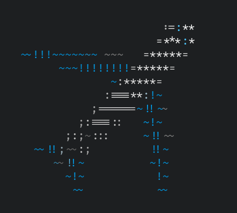

```shell
aarty -m colored images/airplane.png -s 2
```
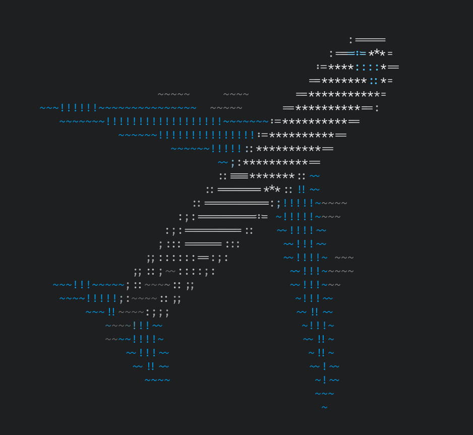

```shell
aarty -c " ~okOK#\$%" images/ok_hand.png
```
```
                                        
                     $$$#               
                     #$$$$#             
                  K#KO#$$$$#            
                  k###O#$$$$#           
                    kK#OK$$$$#K         
                      OKKO#$$$#         
              O#$$#O    KKK$$$$#        
         K$$$$$$$$$$$$$#OOk#$$$#K       
         K$$$$$$$$$$$$$$$$##K#$$#K      
       #$K OO     OK#$$$$$$$$$$###      
      #$$$$#         OO##$$$$$$$$$#     
      O#$$$$#          #$$$$$$$$$$KO    
       K#$$$$#       K#$$$$$$$$$$KO     
       O#$$$$$$#KK####$$$$$$$$$##K      
         K#$$$$$$$$$$$$$$$$$$$$#KO      
          K##$$$$$$$$$$$$$$$$$##O       
           kK###$$$$$$$$$$$$###K        
             OK######$$######KO         
                OOKKKKKKKKOO            
```

```shell
aarty -c " ~okOK#\$%" images/ok_hand.png -m colored
```
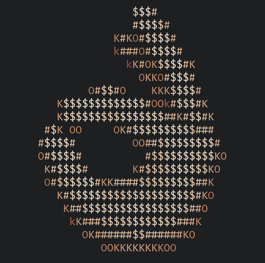

```shell
aarty -c " ~okOK#\$%" images/ok_hand.png -m colored --output-method file -o ok_ascii.txt
```
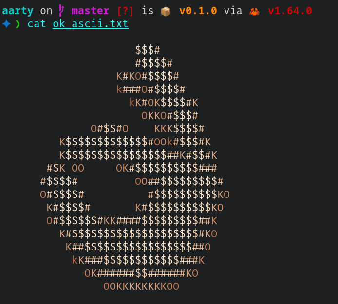

> If you get here, don't forget the star yooo ⭐


[](https://spdx.org/licenses/MIT.html)
