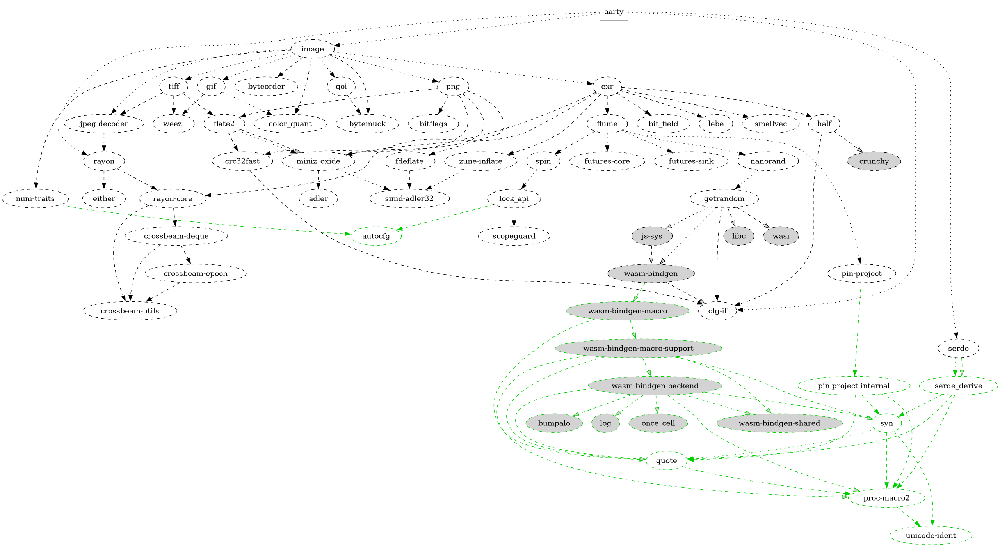

<p align="center">
    
</p>

## **aarty**
mini freamwork to render images in the terminals/ttys.

[](https://crates.io/crates/aarty)
[](https://docs.rs/aarty)
[](https://crates.io/crates/aarty)
[](https://github.com/0x61nas/aarty/blob/aurora/LICENSE)

## Examples
```rust
let cfg = Config {
    sympols: vec![' ', '.', ',', '-', '~', '!', '*', '%', '$', '@', '#'].into(),
    background: None,
    flags: 0,
};
let image = image::open("mylove.jpg").unwrap();
let (w, h) = image.dimensions();

let mut out = BufWriter::with_capacity(cfg.calc_buf_size(w, h), io::stdout().lock());

convert_image_to_ascii(&cfg, &image, &mut out).expect("IO error");
```
Enable the foreground colors
```rust
let cfg = Config {
    sympols: vec![' ', '.', ',', '-', '~', '!', '*', '%', '$', '@', '#'].into(),
    background: None,
    flags: COLORS,
};
// ...
```
Reverse them with the background color
```rust
let cfg = Config {
    sympols: Sympols::empty(),
    background: Some((232, 209, 204).into()),
    flags: COLORS | REVERSE,
};
// ...
```
If you wanna build a rebresentesion in memory so you can modify it or use it multiple times, then you may found that implement [`FragmentWriter`]
for such a structher is useful.
```rust
struct TerminalFrame {
    fragments: Vec<(char, ANSIColor)>,
   cfg: Config,
}

impl FragmentWriter for TerminalFrame {
    fn background(&mut self, _: &ANSIColor) -> Result<bool, Box<dyn std::error::Error>> {
        // Nah, I don't care, I have my configs :p
        //  but pretent like if you care so it will skip the swap operation.
        Ok(true)
    }

    fn write_fragment(&mut self, info: FragmentInfo) -> Result<(), Box<dyn std::error::Error>> {
        self.fragments.push((info.sym, info.fg));
        Ok(())
    }

    fn write_colored_fragment(
        &mut self,
        info: FragmentInfo,
        _: Option<&ANSIColor>,
        _: Option<&ANSIColor>,
    ) -> Result<(), Box<dyn std::error::Error>> {
        self.write_fragment(info)
    }

    fn write_bytes(&mut self, _bytes: &[u8]) -> Result<(), Box<dyn std::error::Error>> {
        // Just ignore them
        Ok(())
    }
}

// So you can use it as a buffer
let cfg = Config {
    sympols: vec!['.', ',', '0', '1', '2', '3', '4', '5', '6', '8'].into(),
    background: None,
    flags: 0,
};
let image = image::open("mylove.jpg").unwrap();
let (w, h) = image.dimensions();
let mut frame = TerminalFrame {
    fragments: Vec::with_capacity(w * h),
    cfg: cfg.clone(),
};
aarty::convert_image_to_ascii(&cfg, &image, &mut frame).expect("Write error");
... Do whatever you want with this object
```
But be aware if you take this way, you'll have to implement the rendaring mechanism when its its the time to print the image (a.k.a. rendering it).

For such this case, we have [`TextImage`], which basically dose the same thing as the code above but in more ergnomic way, And it does implement the rendering mechanism, so you can just print it, and it will render the image properly.
You can enable this type with `text_image` feature, which is enabled by default.

The `text_image` feature also include the [`ToTextImage`] trait, which provide an ergonomic way to construct an [`TextImage`] object.
```rust
use aarty::ToTextImage;
let cfg = Config {
    sympols: Sympols::empty(),
    background: Some((232, 209, 204).into()),
    flags: COLORS | REVERSE,
};
let image = image::open("mylove.jpg").unwrap().to_text(cfg);
println!("{image}");
```
> You have to enable the `image` feature for this to work.

## The binary
We offer a simple binary that's implement the most of this crate features. You can build it with the build command or if u use cargo then you can install it via `cargo install aarty`.

> [!Note]
> for more information about the binary and how to use it, you can run `aarty -h` or see this [document](./docs/bin.md).


## Contributing
I'm happy to accept any contributions, just consider reading the [CONTRIBUTING.md](https://github.com/0x61nas/aarty/blob/aurora/CONTRIBUTING.md) guide first.

> the main keywords are: **signed commits**, **conventional commits**, **no emojis**, **linear history**, **the PR shouldn't have more than tree commits most of the time**

## License
This project is licensed under [MIT license][mit].

[mit]: https://github.com/0x61nas/aarty/blob/aurora/LICENSE


## Dependencies graph



> Generated with [cargo-depgraph](https://crates.io/crates/cargo-depgraph)
